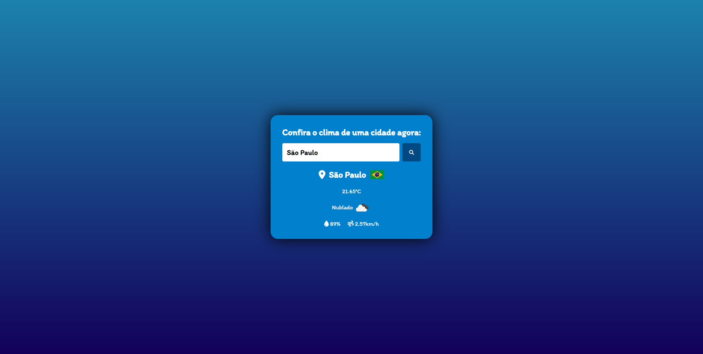

# Weather_app
pt-br:
Para rodar o programa basta criar uma key da API e colocar no arquivo javascript.

en-us:
To run the program just create a API key and put in javascript file.

## 🚀 Technologies
This project was developed with the following technologies:
- HTML
- CSS
- JavaScript
- Git & Github

## 📚 Libraries
- [JavaScript](https://developer.mozilla.org/pt-BR/docs/Web/JavaScript)
- [API](https://openweathermap.org/api)
- [Font](https://fonts.google.com/)

## 💻 Project

[Click here to access project](https://calculadora-imc-alpha.vercel.app/)
> **Objective:** Create a Weather APP.
